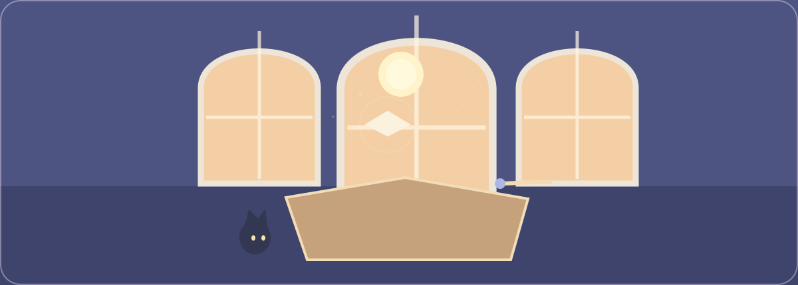

<p align="center">
  
</p>

# Summer's Magic Room

### Summer, aka Shiami the Witch · 大夏的魔法书屋

一个可以自由漫游的三渲二魔法书房。三扇拱窗会随晴雨、昼夜与四季改变光线；魔杖、古琴、小黑猫与漂浮的微光让每一次探访都留下一点回应。

*A stylized, explorable Three.js reading room. Its three arched windows respond to weather, time, and season; a wand, guqin, black cat, and floating motes answer each visit in small ways.*

> If you are a woman and dare to look within yourself, you are a Witch. ——W.I.T.C.H New York, 1968
>
> 如果您是女性 并敢于自我观照， 那您就是女巫。 ——WITCH宣言 纽约，1968

<p align="center">
  <sub>GitHub displays the motion as a GIF. The editable SVG source and motion specification live in <code>assets/readme/</code>.</sub>
</p>

## Enter the room · 进入小屋

```bash
npm install
npm run dev
```

Open [`/daxia-v2.html`](./daxia-v2.html) in the local Vite server. Drag to orbit around the room, scroll to zoom, and use the weather, time, season, ambience, wand, and cat interactions in the interface.

在本地 Vite 服务中打开 [`/daxia-v2.html`](./daxia-v2.html)。拖拽可环绕观看，滚轮可缩放；界面内可选择天气、时刻与四季，并与环境音、魔杖和小猫互动。

## What the room responds to · 小屋会回应什么

| Interaction | Response |
| --- | --- |
| Time and weather · 时刻与天气 | A single sun follows a coherent path across the three front windows; sunset warms to orange-red, while clouds, rain, and snow soften the daylight. · 唯一的太阳沿前方三窗移动；晴天日落转为橙红，阴雨与雪天的自然光更柔和。 |
| Four seasons · 春夏秋冬 | Exterior planting, falling material, sky color, and ambience shift from spring bloom to summer green, autumn maple, and winter snow. · 窗外植被、飘落物、天空与环境音会随四季改变。 |
| Magic wand · 魔杖 | Click to lift the wand and trigger one calm, room-wide spell: gold motes, pale-pink petals, snow, maple leaves, or a soft star-firework. Click again to return it to the desk. · 点击让魔杖升起并随机触发流金、樱吹雪、飞雪、枫叶或星空烟花；再次点击回落。 |
| Black cat · 小黑猫 | The cat sleeps until awakened, meows when selected, watches the pointer, and walks toward a later click with a connected body rig. · 小猫平时安睡；点击后会喵叫、注视鼠标，并向之后点击的位置自然走去。 |

## Built for a small, tactile world · 为可触摸的小世界而作

- **Three.js + React** create the navigable diorama and its stylized lighting.
- **Vite + TypeScript** keep the room quick to run and straightforward to extend.
- **Season, weather, time, and sound controllers** make the room a stateful scene instead of a fixed illustration.
- **No account, server, database, or API key is required.** Everything needed to explore the room ships in this repository.

## Project map · 项目结构

```text
src/experiments/daxia-v2/  # Room scene, interactions, light, cat, sound, and UI
public/assets/             # Reference image and local cat audio
assets/readme/             # README artwork: static SVG, animated SVG, GIF, and motion spec
tests/                     # Room behavior tests
daxia-v2.html             # Standalone room entry point
```

## Verify · 验证

```bash
npm run build
npm test
```

The build output is written to `dist/`, which is intentionally excluded from version control.

构建产物位于 `dist/`，该目录不会提交到版本库。

## Privacy · 隐私

This standalone room does not collect visitor data and includes no credentials, API keys, local paths, or chat history. Keep future secrets outside the repository if you add deployment services later.

本独立小屋不收集访客数据，仓库中不包含密码、API key、本地路径或聊天记录。若未来接入部署服务，请将密钥保存在平台环境变量中。

## Credits · 鸣谢

- The cat meow sound is [“Cat Meow 2” by Freesound user dnlburnett](https://freesound.org/s/526092/), released under [CC0](https://creativecommons.org/publicdomain/zero/1.0/). See [`public/assets/audio/daxia-v2/CREDITS.md`](./public/assets/audio/daxia-v2/CREDITS.md).

## License recommendation · License 建议

Use a **two-part license**:

1. **MIT License** for source code, configuration, and documentation.
2. **CC BY-NC-SA 4.0** for original visual, audio, and narrative assets.

Third-party files keep their original licenses. This is a recommendation, not a license grant: add the two license texts only after confirming ownership or permission for every included asset.

---

Made as a room to linger in — 一间可以停留片刻的书房。
